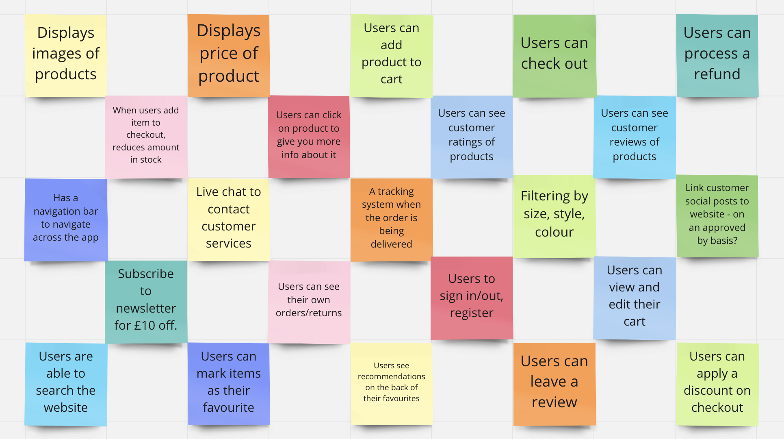
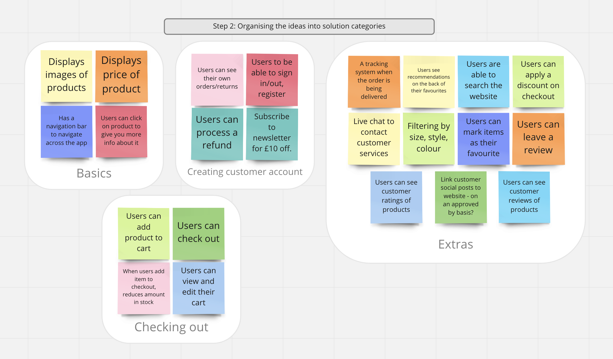

# Golden-Shoe

## [Planning & Mind-Mapping](https://miro.com/app/board/uXjVOFBHPnM=/)

First of all, I started by creating a mind-map of the features and functions I would like the new Golden Shoe website to incorporate. I've included a screen shot of the mind-map below. 


I then organised the ideas into categories of which features/ideas link together. 


After having done this, I decided on the solution I wanted to work on - the checkout process. I will first need to build the basic section and then move onto the checkout. 

## User Stories

```
As a customer,
So that I can see what products Golden Shoe sells, 
I'd like to see images of their products.
```

```
As a customer,
So that I know how much a product costs, 
I'd like to see the price next to the product.
```

```
As a customer, 
So that I can find out more about a product, 
I'd like to be able to click on a product to find out more about it,
```

```
As a customer, 
So that I can explore around Golden Shoe's website, 
I'd like to have access to a navigation bar. 
```

```
As a customer, 
If I would like to buy a product, 
I'd like to add it to my shopping cart. 
```

```
As a customer, 
So that I know what is in my cart, 
I'd like to be able to view my cart.
```

```
As a customer, 
So that I can take items out, or put items in, 
I'd like to be able to edit my cart.
```

```
As a customer, 
So that I can pay for my items, 
I'd like to go through the checkout process.
```

```
As an employee of Golden Shoe,
So that I know how much of each product I have left, 
I'd like the system to update when a customer adds to or removes from their shopping cart. 
```

```
As an employee of Golden Shoe, 
So that customers cannot select sold out items, 
I'd like for the items to be marked as 'sold out' and disable the customer's ability to add to cart. 
```


## Tech Stack & Resources

- [Miro](https://miro.com/app/dashboard/) for mind-mapping and drawing diagrams.
- [Prettier](https://prettier.io/) for code-formatting.
- [ESLint](https://eslint.org) to minimise errors.